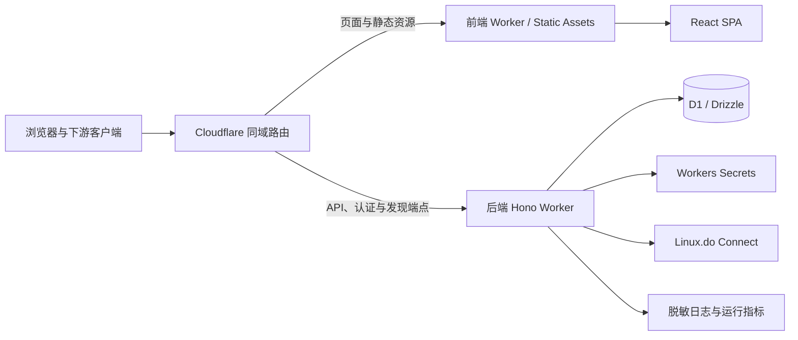
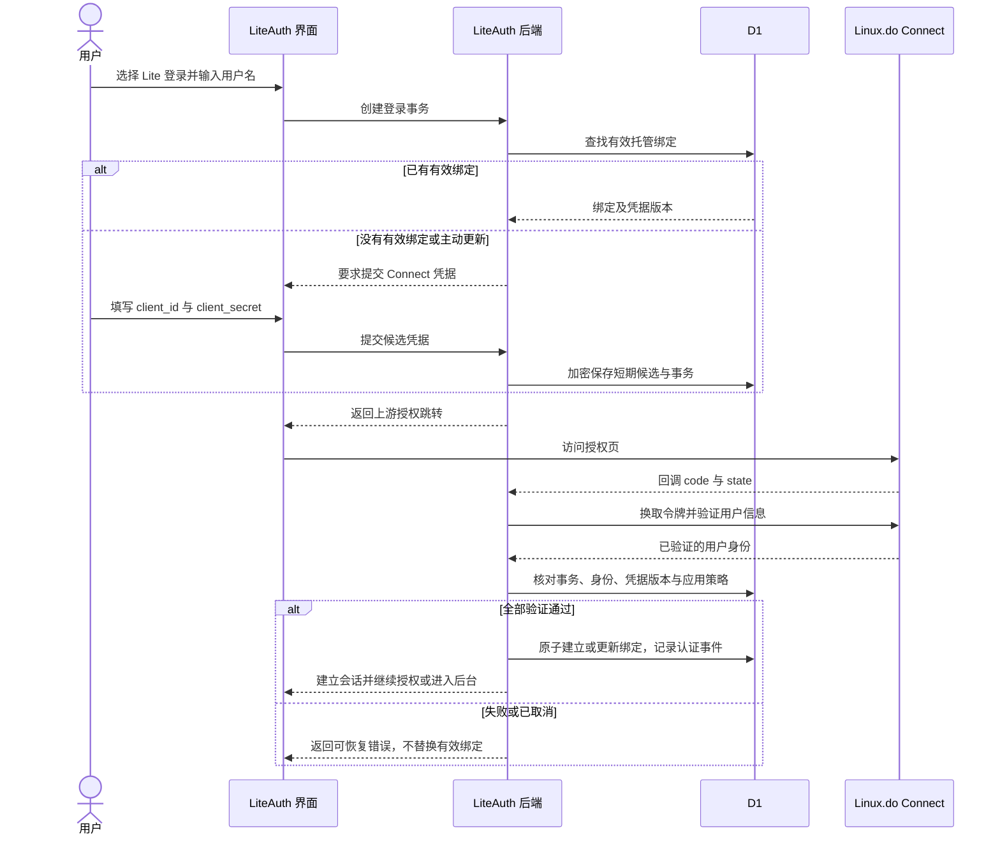
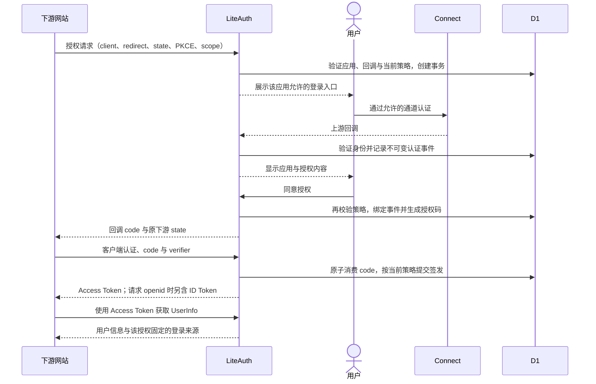

# LiteAuth 产品与技术立项调研

> 本文保留立项时的公开来源、协议与架构依据。域名为配置示例，历史实测账号已匿名化；最新开源修复与验证结果见 [验证记录](./validation.md)。
> 调研基准：2026-10-05（Asia/Shanghai）。
> 文档状态：产品规则与实施方案已接受；研究引用保留原始调研快照，当前运行状态按第 12 节及 [验证记录](./validation.md) 更新。
> 适用对象：产品负责人、开发者、测试人员、平台运维及准备接入的站长。
> 生产地址为 `https://liteauth.example.com`，隔离验证环境为 `https://staging.liteauth.example.com`。本轮接受的上线验收已通过：staging 九阶段 RP、策略与身份、远程 D1，以及正式部署／冒烟／双通道真实回调／六阶段 RP。范围与收尾见 [发布验收清单](./release-readiness.md)，实际版本见 [发布清单](./release-manifest.md)。
> 2026-10-05 后续升级增加等级限制、下游密钥重复查看及七天记录。下文规则已同步到该升级；初版的历史上线证据保留，升级实现、检查与发布状态单独见 [升级记录](./upgrade-2026-10-05.md)。
> 2026-10-06 已合并发布用户改名登录修复、管理员账号详情及 Connect 验证日志。176 项 Workers、38 项界面测试、23 项真实 staging D1 合成证明及两环境各 7/7 冒烟通过，独立审查无阻塞。按用户最新授权，本轮真人改名和交互回归未执行；初版真实证据只作历史，见 [合并升级记录](./upgrade-2026-10-06.md)。

## 1. 立项结论

**LiteAuth 是 Linux.do 生态的 OAuth 代理与接入层。平台 Connect 登录与用户自有 Connect 应用登录并存，第三方站通过创建 LiteAuth 应用接入。**

- 品牌：**LiteAuth**。
- Slogan：**OAuth for Lite users.**
- 核心用户：需要通过自建 Connect 应用登录的 Lite 用户，以及希望接入两种认证通道的站长。
- 技术方向：Hono、Drizzle、Cloudflare Workers/D1；前后端独立发布、同域服务；认证协议优先复用成熟依赖。

资料调研已完成实现与本轮实际上线验收：staging 的双通道／Lite-only 通用 RP、策略、远程 D1 与同账号跨上游身份通过；正式环境的部署、7/7 冒烟、官方／Lite 真实回调及两份完整 RP 报告也独立通过。结论限于已接受的首版协议范围和实际公开 PKCE 客户端，不扩展为所有下游服务兼容。凭据接纳规则为凭据可用、回调身份一致且上游 client ID 全局唯一，不额外执行独立应用所有权证明，也不增加平台许可前置步骤；不声称登记所有权已证明或 Linux.do 官方认可。

LiteAuth 不会使尚未接入的公益站、LDC、CDK 等系统自动接受 Lite 用户。下游站长必须主动接入，并决定允许的认证来源、账号准入与操作权限。

### 1.1 证据状态

| 标记 | 含义 | 不代表什么 |
|---|---|---|
| 资料已确认 | 已读取公开文档、规范或可核对的站方说明 | 不代表已在当前真实账号上复现 |
| 源码已确认 | 已核查指定版本或提交中的实现 | 不代表组合依赖已在 Workers/D1 跑通 |
| 本地／远程／真实实测 | 已运行相应环境并保留脱敏结果；注明具体层次与场景 | 本地测试不替代实际上游，合成远程证明不替代真实下游，staging 不替代 production |
| 待实测／待确认 | 需要真实账号、真实部署或并发测试的运行结论 | 不得作为已经满足的上线条件 |

本文中的接口、实体、界面及测试约束保留产品设计依据。研究引用本身只证明资料或源码事实；实现状态和已经执行的场景以第 12 节及独立验证记录为准，不把计划中的边界能力写成已经实现。

## 2. 调研证据与边界

| 议题 | 已取得的证据 | 结论及边界 | 来源 |
|---|---|---|---|
| Lite 自建应用登录 | 社区指南说明本人应用例外；实施后真实 匿名化的 Lite 测试账号 登录和 Lite 下游 RP 已成功 | 真实案例有独立运行记录，不证明其他账号或任意应用均可用 | [S1](#s1)、[验证记录](./validation.md) |
| 自建应用例外的用途 | 指南引用 neo 的说明，理由是方便调试 | 引用不是公开密钥托管、共享或代理服务的运营许可；本轮未独立读取该回复当前完整正文 | [S1](#s1)、[S2](#s2) |
| Connect OAuth 接口 | Wiki 源码给出授权码、令牌、用户信息端点和字段 | 文档版本较旧，不据此断言现行能力只有 OAuth | [S3](#s3) |
| Connect OIDC | 官方 Credit 源码使用 Connect issuer 进行 OIDC 发现，失败可回退 OAuth | 存在官方消费者接入证据；本轮未成功读取在线发现文档，不能等同于完成运行验证 | [S4](#s4) |
| Connect 用户标识 | Wiki 描述原生 `id`；已通过 匿名化的测试账号 平台与一个自有应用的实际认证与只读 SQL 核对 | 相同的稳定用户 ID、两种方法、两个上游应用对应一个 LiteAuth 用户；OIDC `sub` 与原生 `id` 分别验证，不额外要求两个自有应用 | [S3](#s3)、[S4](#s4)、[验证记录](./validation.md) |
| New API 接入 | 核查 `1a4166d8e8ba9802d2ca56fe8ecf0ed5404e80d5`：内置授权地址硬编码；自定义 Provider 可配置端点 | 优先新增自定义 Provider；不能承诺内置 LinuxDO 配置只换凭据即可迁移 | [S5](#s5) |
| New API 身份字段 | 内置适配器读取数字 `id`；自定义 Provider 使用独立提供方命名空间 | Connect 兼容 `id` 必须保留原始 Linux.do ID；既有账号需显式绑定 | [S5](#s5) |
| New API PKCE | 该版本内置和自定义 OAuth 路径均未发送 PKCE | 对未适配的服务端保密客户端需要明确的兼容配置；不能称为无条件兼容 | [S5](#s5) |
| Workers 同域独立部署 | 同主机名下具体 Routes 优先于 Custom Domain | 可由两个独立 Worker 服务同一域名，无需跨域会话 | [S6](#s6) |
| D1 事务 | D1 batch 中 SQL 失败会回滚；Drizzle 有 D1 驱动和 batch 接口 | 零行条件更新不等于失败；不能假定普通交互式事务可用 | [S7](#s7) |
| 认证依赖 | 锁定 Better Auth／OAuth Provider 1.7.7、`openid-client` 6.8.8；109 项本地 Workers 测试、11 项远程 D1 证明及双通道六阶段 RP 通过 | 当前组合已运行验证；结论限于记录的协议范围、应用类型和环境 | [S8](#s8)、[S9](#s9)、[验证记录](./validation.md) |
| Motion | 官方提供减少动态效果和按需加载能力 | 可用于简洁界面的过渡与反馈，不需要复杂动画框架 | [S10](#s10) |

直接访问部分 Connect/Wiki 页面时遇到 Cloudflare challenge，因此使用了公开源码及其他第一手资料作为补充。访问阻挡不证明接口不存在；源码支持某能力也不证明当前线上配置已启用。

### 2.1 凭据接纳规则与证据边界

一次成功的 OAuth 流程能够验证：提交的客户端凭据可以完成协议操作，以及实际上游授权者的身份。它不普遍证明该授权者就是 Connect 应用登记所有者。[S11](#s11)

Lite 账号只能授权本人应用的规则如果持续成立，可以提供额外约束；但普通账号可能可以授权其他人的应用。全局唯一索引只能防止同一应用被重复绑定，不能证明最先提交的人是所有者，也不能消除泄露凭据抢占绑定的风险。

已接受的首版不引入独立的应用所有权验证或额外平台许可流程。提交者声明授权 LiteAuth 托管凭据，后端完成一次真实 OAuth 验证，并核对输入／既有绑定账号与返回身份、凭据版本及全局唯一 client ID。有效凭据不能跳过身份一致性校验，唯一索引也不能跳过真实验证。用户声明作为授权记录保存，界面和文档只称“凭据已验证／已绑定”，不称“所有权已验证”。

公开资料尚不能证明平台对本项目托管与代理方式的运营认可；按已接受的范围，这属于资料边界，不是新增的实施或发布确认步骤。

## 3. 产品范围与用户角色

### 3.1 严格区分的对象

| 对象 | 创建位置 | 持有者及用途 |
|---|---|---|
| 平台 Connect 应用 | Linux.do Connect | 管理员配置，供官方通道登录 |
| 用户 Connect 应用 | Linux.do Connect | 用户提交，供自有应用通道登录 |
| LiteAuth 下游应用 | LiteAuth | 站长创建，供第三方网站接入 |
| 认证事件 | LiteAuth 后端 | 记录一次实际认证的身份、通道和上游应用 |
| 下游授权 | LiteAuth 后端 | 绑定下游应用、认证事件、权限、有效期和令牌 |

`official_connect` 表示使用平台配置的 Connect 应用认证，不表示 Linux.do 官方运营或背书 LiteAuth。`lite_self_app` 表示使用用户托管的自有应用通道，也不等于该账号当前必定属于 Lite 等级。

### 3.2 用户能力

无论通过哪条通道登录，用户均可管理自己的 Connect 凭据、创建和管理 LiteAuth 应用。首版默认每个用户只有一份有效的自有 Connect 绑定，允许保留历史版本及归属记录。

应用所有者可以配置名称、回调地址、凭据、`lite_only` 和 0～4 的最低等级，并查看自己应用最近七天的登录记录。管理员可以处理平台配置、禁用、全站操作审计及绑定转移，但查看他人的应用不授予读取该应用 secret 的权限，所有权变更必须有明确记录。

### 3.3 首版边界

首版包括双通道登录、上游凭据管理、下游应用管理、授权同意、授权码 OAuth、标准 OIDC、登录来源声明和应用级 Lite-only 策略。

后续升级在同一协议范围内增加最低等级、可重复查看的下游密钥、应用登录记录与完整的操作人审计；不改变首版已关闭的授权类型。

首版不开放动态客户端注册、刷新令牌、隐式流、密码流、设备流或机器间授权。注册下游应用必须经过已登录的用户管理流程；“允许站长自助创建应用”不等于开放协议级匿名动态注册。

不建设跨站统一会话清除，也不替代下游账号、权限、封禁和操作级风控。后续能力根据实际接入需求扩展。

## 4. 技术架构与部署

### 4.1 工程与状态边界

| 层次 | 选择 | 职责 |
|---|---|---|
| 工作区 | TypeScript、pnpm workspace | `apps/web`、`apps/api`、`packages/contracts` |
| 前端构建与导航 | React、Vite、TanStack Router | SPA 页面与 URL 状态 |
| 样式与交互 | Tailwind CSS、Motion、shadcn/ui、Radix | 简洁组件、无障碍交互和克制动效 |
| 表单 | React Hook Form、Zod | 表单状态与共享输入校验 |
| 服务端数据 | TanStack Query | 获取、缓存、失效、修改结果和重新验证 |
| 临时界面状态 | Jotai | 必要的跨组件临时状态；不复制 Query 数据 |
| API | Hono | 业务 API、认证集成、错误处理和类型契约 |
| 数据 | Drizzle、Cloudflare D1 | 持久化、唯一约束、条件写入与迁移 |
| 上游 OAuth/OIDC | `openid-client` | 协议请求和响应校验 |
| 会话与下游授权 | Better Auth、`@better-auth/oauth-provider` | 成熟会话、客户端、授权码、令牌及 OIDC 能力 |
| 运行设施 | Cloudflare Workers、Static Assets、Secrets、Logs、Metrics | 托管、静态资源、密钥、日志与运行指标 |

共享包只包含安全的类型、校验定义和必要常量。前端不导入数据库、密钥或后端运行时模块。业务请求优先复用 Hono 类型能力，不再维护一套重复的手写 DTO。

首版不引入额外构建编排器、外部数据库、Redis、KV、Durable Objects 或 R2。若未来需求需要这些设施，另做有证据的选型；KV 不能承担本方案中的一次性授权消费与即时撤销判断。[S12](#s12)

### 4.2 两个 Worker，同一个公开域名



前端 Worker 通过 Custom Domain 承载 `liteauth.example.com`。后端 Worker 通过更具体的同域 Routes 接管 `/api/*`、`/auth/*`、`/oauth2/*`、`/.well-known/*`。Cloudflare 官方文档明确支持 Routes 与 Custom Domain 在同一主机名下组合，前者优先。验证环境使用 `staging.liteauth.example.com`，配备独立 Worker、D1 与凭据，不能复用生产认证数据。[S6](#s6)

实施约束：

- 域名所在 Zone 必须在 Cloudflare 激活；正式域名和证书配置属于部署前置条件。
- 前端采用 SPA fallback，支持 TanStack Router 深链接刷新。
- 所有上游回调、下游协议端点及发现端点都必须由后端路由接管。
- 路由要覆盖带查询参数的请求，使用正确的尾部通配。`/api/*` 不覆盖裸 `/api`；若暴露裸路径，必须额外处理，不能假定已有覆盖。
- 后端未知 API 返回 JSON 404，协议失败返回对应错误；不使用 `fetch(request)` 把未知认证请求继续送到前端 SPA。
- 两个 Worker 独立构建、独立发布，但共用同一浏览器 origin。首版不引入跨域 Cookie 或跨域凭据请求。
- 生产环境关闭后端 `workers.dev`，并单独关闭或保护版本／预览 URL；不能认为关闭 `workers.dev` 已处理全部入口。

### 4.3 发布与数据库演进

采用 Cloudflare 构建和发布能力，分别配置前端、后端的构建命令与产物。共享契约变化必须触发受影响的检查。独立发布期间，新旧前端与 API 应保持兼容，破坏性变更需明确版本和迁移顺序。

Drizzle 生成 SQL 迁移，由 Wrangler 对本地、验证环境和生产分别执行。只维护一套迁移执行记录，不让两个工具分别推进同一数据库状态。迁移必须先在验证环境检查；回滚应用版本不能被描述为自动回滚数据库。

认证敏感查询首版直接使用 D1 主库路径，不主动启用读副本会话优化。若以后采用 D1 Sessions API，仍需重新验证一致性与撤销语义，不能将 bookmark 当作事务锁。[S7](#s7)

## 5. 认证依赖与必须验证的接缝

### 5.1 首选组合

`openid-client` 是上游首选：其官方说明支持 Workers，接口层次高于 `oauth4webapi`，可以减少自行编排协议步骤。上游端点固定为已验证的 Connect 配置，不接受用户提交任意 issuer 或 token URL。

Better Auth 与 OAuth Provider 是会话及下游授权首选。实施锁定 `1.7.7`，对应源码证据固定在提交 `db02f233918ad1233bf0753e437e1c0da353273d`，发布记录确认该版本不是预发布。锁定版本与源码研究之外，当前已有独立的本地 Workers、远程 D1 和真实 staging RP 证据；不能将主分支新增能力当作稳定发行能力，也不能把这些结果延伸为正式域名已验收。[S8](#s8)、[S9](#s9)

Hono 官方集成以 `/api/auth/*` 挂载认证处理器，路径必须与库的 `basePath` 一致。Workers 需要 AsyncLocalStorage 支持，按锁定版本使用文档要求的 `nodejs_compat` 或相应的 `nodejs_als`，而不是自行模拟 Node 运行时。[S9](#s9)

采用库原生的授权码、客户端认证、PKCE、签发、发现和 JWKS 能力。业务代码负责 LiteAuth 特有的凭据托管、身份关联、认证事件和应用策略，不从零实现整个 OAuth 服务端。

### 5.2 动态上游凭据

用户自有通道的 `client_id` 和 secret 随事务变化。不能通过改写共享的全局 Provider 配置处理当前用户，否则并行请求可能串用凭据。

上游登录通过小型定制集成调用 `openid-client`，在认证库公开的插件、会话与适配接口上建立本地身份。必须验证无真实邮箱的账号映射方式；库需要内部占位信息时，不得将其作为真实或已验证邮箱向下游发布，也不得按该字段合并用户。

### 5.3 授权上下文与 D1

认证库具备自定义 claims 并不意味着天然保存了正确的本次登录来源。优先通过绑定不可变认证事件的会话／授权引用生成声明，不能从 `user.last_login_method` 或客户端可编辑 metadata 推导来源。

已核查版本的普通 `customIdTokenClaims` 只获得用户、scope 与客户端 metadata；扩展接口中的 `sessionId` 是尽力提供，在 introspection 等路径可能缺失。opaque token 的自定义声明还可能在 introspection 时重新计算，单次签发的 `accessTokenClaims` 不会自动持久化到 opaque token。必须验证授权级认证事件如何在所有启用的令牌路径中持续可解析；不能因为某个签发回调拿到了 session ID，就认定 UserInfo 和后续验证也有相同上下文。[S9](#s9)

同样，业务自己的条件 SQL 正确，不代表认证库内部采用了相同的原子路径。必须验证真实 Drizzle/D1 适配下的授权码消费、签发失败处理和策略检查，而不是只在内存数据库或 mock 中通过测试。

任何关键接缝不成立，都应将选型标记为阻塞，评估适配、替代依赖或上游修复；不能自动降级为全量手写授权服务器。

### 5.4 已接受的来源绑定与持久授权适配路线

以下路线最初依据 `1.7.7` 固定提交源码制定，现已实现并通过 Workers/D1 与真实客户端验证。源码依据与运行证据仍分别记录：源码见 [S9](#s9)，实际结果见 [验证记录](validation.md)；公开验证摘要见同一文档。

1. 保留 Better Auth 的 JWT 插件处理签名 ID Token 与 JWKS。授权码和兑换请求不接受 `resource`，关闭资源驱动的 JWT Access Token 路径，使用库的 opaque Access Token 存储路径；不能通过关闭 JWT 插件误把 ID Token 改为客户端 secret 签名。
2. 一次真实上游登录生成不可变认证事件，将其 ID 写入本地 session 的 `authEventId` 服务端字段。该字段禁止客户端输入；换登录通道建立新事件与会话，不能覆盖旧事件。
3. `postLogin.consentReferenceId` 从已验证 session 取得 `authEventId`。库将该引用写入同意记录、授权码 verification 与 opaque token 的 `referenceId`；新认证事件需要重新同意。扩展 claims 根据 `referenceId` 查找不可变事件，UserInfo 使用已验证令牌的来源声明，不能退回到用户最近登录字段。
4. 在 Drizzle/D1 适配器上增加有界 decorator，复用库的协议校验与签发流程。在创建授权码 verification 时，同一批次持久登记关联事件和应用的 grant；grant 保留 `pending`、`canceled`、`issued` 状态。库消费 verification 后，grant 继续存在，因此已经消费但尚未签发令牌的 code 仍受取消与最终签发检查约束。
5. opaque token 插入前，以同一次 D1 原子提交完成最终应用策略校验、grant 的有效状态转移和令牌记录创建。取消后的 grant 永不恢复；零行条件写入不能继续无条件插入。只在提交成功后返回令牌，签发异常可要求重新认证，但不能允许重复成功。

固定源码中，`authorize.ts` 使用 `consentReferenceId` 查找同意并保存 code 的 `referenceId`；`token.ts` 调用 `consumeVerificationValue`，将引用写入 opaque token；`introspect.ts` 以 token 持久化的 `referenceId` 重新生成扩展声明。这说明来源可沿库原生路径传递。实际 Cloudflare D1 已通过提交顺序、取消与并发插入证明，其中包含“code 已消费、token 尚未提交”时开启再关闭 Lite-only 仍拒绝签发的场景；故障、重放和来源切换另有本地 Workers 回归。该合成证明与正式环境真实 OAuth/OIDC 报告保持独立。

开启 Lite-only 只取消待完成官方 grant。已经 `issued` 的官方授权保持原方法和到期时间，仍可获取 UserInfo，直到自然到期或其他明确撤销事件；decorator 不能通过读取当前开关使这类历史令牌提前失效。

## 6. 账号、凭据与登录流程

### 6.1 平台准备与官方登录

管理员先在 Connect 创建平台应用，配置回调，并通过部署配置与 Workers Secrets 提供官方通道凭据。该上游 client ID 纳入保留集合，不能被普通用户托管绑定。管理权限不由下游应用 metadata 或浏览器声明授予。

官方通道完成标准上游认证后，根据经过验证的稳定 Linux.do ID 查找或建立 LiteAuth 账号，创建 `official_connect` 认证事件，再进入管理后台或恢复特定下游授权事务。

### 6.2 Lite 首次提交与已有凭据登录



用户名用于初始路由、展示与首次身份核对。绑定建立后，以稳定 ID 作为权威身份；账号改名不能导致新建重复账号或把旧名字重新关联给另一个人。

手动提交候选凭据时，不按本地用户名命中结果选择 owner。已有 Client ID 按原绑定 owner 锁定用户 ID；新 Client ID 在回调验证后按 Linux.do ID 找回原账号。只有未知目标才比较本次输入名与回调当前名。托管凭据查找出现多个同名候选时要求手动填写，不猜测身份。

凭据变更采用 D1 单调版本保护：事务原子记录启动版本，触发器监听用户 `credential_epoch` 的变更并记录该用户的最新变更版本，最终提交校验事务未跨越该账号的撤销或更新。不能用初始 epoch=0 代表回调后才发现的老账号，也不能直接采用回调时的最新 epoch 跳过期间的撤销。

候选凭据在验证完成前仍需用于后端兑换，因此只能以短期、加密的服务端事务数据保存，不放入 URL、浏览器持久存储或日志。候选失败、过期或取消后清理，不取得永久唯一占位。

更新凭据采用“先验证候选，再替换有效版本”。在途事务固定使用已记录的凭据版本；更新或删除后对旧事务的处理必须显式判断，不能回调时重新读取最新 secret 并假定相同。

### 6.3 下游授权与来源冻结



已有会话可以在有效期和认证新鲜度允许时复用，但其认证事件必须满足目标应用策略。拥有托管凭据不是已完成 Lite 认证的证明。下游授权同意界面需要明确目标应用与实际请求的数据，不能借平台登录代替对任意应用的同意。

## 7. 下游应用的准入策略

### 7.1 字段、权限与界面

下游应用增加 `lite_only: boolean`，默认 `false`。创建、读取和更新接口、Drizzle 模型、共享校验及管理页面均使用同一语义。只有应用所有者或管理员可以修改。

该开关只影响对应下游应用的授权上下文，不改变 LiteAuth 平台登录设置；管理后台始终保留双通道登录。

界面标签为 **“仅允许 Lite 用户登录”**。该标签对应的是 `login_method === "lite_self_app"`，不是检查用户等级。普通账号主动通过自己的应用认证，也属于此通道。

| 设置 | 对应授权登录页 | 可接受的认证事件 |
|---|---|---|
| `false` | “非 Lite 用户登录”与“Lite 用户登录”都可操作 | `official_connect`、`lite_self_app` |
| `true` | “非 Lite 用户登录”按钮可见但禁用；Lite 为唯一可操作入口 | 仅 `lite_self_app` |

应用设置是服务端数据，由 TanStack Query 获取和失效管理，不另存为 Jotai 权威状态。保存中显示明确状态；保存失败不得显示已生效，成功后同步服务端返回值并刷新相关查询。

授权页面从经过服务端验证的事务取得应用信息与策略。加载完成前不开放登录操作；加载失败提供重试，不回退到双通道。使用原生禁用按钮，不能仅改变颜色或设置 `pointer-events: none`。

### 7.2 检查位置与绕过防护

在授权开始、上游回调、同意授权和兑换授权码时检查当前策略。最终授权码与令牌签发必须受持久层的策略条件约束，单次中间件检查不能解决与设置变更的竞态。

- 官方会话不能为 Lite-only 应用直接完成静默 SSO 或同意授权；需要实际完成 Lite 认证。
- 已有有效 Lite 会话可以复用，不要求无意义的重复提交凭据。
- 不能根据 `?lite_only=false`、客户端传入的 `login_method` 或用户是否保存过 secret 改变认证来源。
- 授权事务固定 client、白名单 redirect、scope、PKCE、nonce 和继续地址，不能将其他应用事务替换进来。
- 对要求静默认证但当前会话不符合策略的 OIDC 请求，按规范返回需要交互的错误，不能签发错误来源的授权。
- 策略变化导致流程失败时，只有已经验证的下游回调地址才可接收协议错误；非法回调留在 LiteAuth 错误页面。

### 7.3 开关变化与历史授权

| 变化或状态 | 必须执行的行为 |
|---|---|
| 关闭切换为开启 | 提交新策略，取消该应用尚未完成的官方事务和未兑换官方授权码；阻止后续官方签发 |
| 尚未选择登录方式的事务 | 按最新策略继续，可选择 Lite；不能沿用旧的官方入口权限 |
| 已有 Lite 事务和授权 | 按正常规则继续，不因开关开启而误取消 |
| 开关开启前已签发的官方授权 | 访问令牌自然到期；UserInfo 继续有效并保持 `official_connect`，其他显式撤销事件仍可使其失效 |
| 开启切换为关闭 | 允许新的双通道授权；此前取消的事务与授权码不恢复 |
| 其他应用的授权 | 不受该应用设置影响 |
| 下游自己的登录会话 | 由下游根据自身策略和收到的来源字段处理 |

**禁止在 UserInfo 中因当前 `lite_only=true` 追溯拒绝此前已签发的官方访问令牌。** 应检查令牌自身有效期和正常撤销状态，并返回原认证来源。不能把旧来源改成 `lite_self_app`，也不能重新签发令牌来延长旧授权。

OIDC ID Token 已经签发后不能被远程改写。其原始 claims 和到期时间保持不变；下游是否接受该来源、是否结束已有会话，由下游决定。首版不发刷新令牌，因此不存在依靠刷新无限延续旧官方授权的路径。

### 7.4 与签发并发时的确定规则

生效顺序以持久化提交为准，不以浏览器收到响应的时间为准：

1. 官方令牌签发先提交，开关后提交：该授权属于历史授权，自然到期，即使响应稍后才到达客户端。
2. 开关先提交，官方令牌签发后尝试提交：签发失败；即使此前已开始回调或兑换、甚至已通过一次策略检查，也不能继续。
3. 只有授权码已生成但尚未完成令牌签发：属于未完成授权，开启后取消，兑换返回 `invalid_grant`。
4. 被取消的状态持久化；再次关闭开关不会让旧 code 或事务复活。

这一保证必须通过认证库真实存储路径的并发测试证明。策略更新与未完成事务取消需要一致的提交边界；不可用“先读策略、稍后无条件写令牌”替代。

### 7.5 最低等级与认证快照

应用使用 `min_trust_level` 设置最低 Linux.do 等级，取值为整数 0～4，新建应用及历史迁移默认 0。更新接口省略此字段时保留现值，不能因为旧版前端未传字段就降低已配置的门槛。等级与 `lite_only` 是两个独立条件，认证事件必须同时满足它们。

等级以当前真实认证事件的 `trust_level` 为依据，并将其持久化为不可变快照；不从输入用户名、浏览器参数、最近登录字段或可变用户资料推导。一个最长七天的有效管理会话可能保留认证时的等级，而非实时 Linux.do 等级。用户升级后通过“重新验证”建立新事件，再重新开始授权；旧授权继续返回原快照。

登录页及授权页展示目标最低等级与已经验证的当前等级。未确认身份时允许进入符合通道策略的登录入口；已认证但等级不足时说明“此应用要求等级达到 N 级”，提供重新验证入口。会话复用、上游回调、同意、授权码持久化及最终令牌插入均检查当前策略，前端提示不能代替数据库检查。

提高门槛与待完成授权取消在同一 D1 提交中执行：永久取消不满足新门槛的事务及未兑换码，身份尚未确认的旧事务也要求重新开始。降低门槛允许新授权，但不恢复已取消状态。令牌先提交的授权属于历史授权，仍然自然到期；门槛先提交时，后续不符合条件的令牌插入失败。已经消费授权码但尚未写入令牌，也属于待完成授权。

未知或无效的历史等级不能被当作等级 0 放行。迁移只从合法的既有认证 profile 回填 0～4；没有可信等级的事件要求重新认证。

## 8. 对外协议与身份声明

### 8.1 协议轮廓

| 能力 | 首版约束 |
|---|---|
| OAuth | 仅 Authorization Code；Access Token 用于受保护的用户信息接口 |
| OIDC | 请求 `openid` 时签发规范 ID Token，提供发现文档与 JWKS |
| PKCE | 新客户端默认 S256；公共客户端不得省略；旧保密客户端仅通过逐应用明确配置兼容 |
| 客户端注册 | 仅已登录的应用管理流程；关闭开放 DCR |
| 刷新与其他 grant | 不签发 refresh token，不提供 refresh、password、implicit、device、client credentials 等首版外流程 |
| 回调 | 精确白名单校验；授权码绑定 client、redirect 与 PKCE 上下文 |
| 时效 | 事务 10 分钟、授权码 2 分钟、Access Token 1 小时、ID Token 10 分钟；本地 session 最长 7 天，无 refresh；对应上限由本地回归及实测令牌检查核对 |

OAuth Provider 已核查版本的默认 grant 列表还包含 `client_credentials` 与 `refresh_token`，所以首版必须显式配置 `grantTypes: ["authorization_code"]`，同时约束客户端 grant 元数据、scope 和已安装插件。仅拒绝刷新请求不够，还必须证明授权码兑换从不返回 refresh token。[S9](#s9)

保密客户端的兼容配置不等于等效的 PKCE 防护。state、secret、回调白名单与 PKCE 有不同作用，不能宣称前三者完全替代 PKCE。[S11](#s11)

### 8.2 端点与兼容门面

上游已知 OAuth 端点为：

```text
https://connect.linux.do/oauth2/authorize
https://connect.linux.do/oauth2/token
https://connect.linux.do/api/user
```

LiteAuth 下游以认证库原生接口作为规范实现，处理器集中在 `/api/auth` 下，生产 issuer 为 `https://liteauth.example.com/api/auth`，验证环境 issuer 为 `https://staging.liteauth.example.com/api/auth`。已核查版本的原生兑换示例为 `/api/auth/oauth2/token`，默认 OIDC 发现路径随 basePath 为 `/api/auth/.well-known/openid-configuration`。以库实际生成及测试通过的 metadata 为准，不手工伪造另一份 issuer。[S9](#s9)

Connect 风格消费者使用 `/oauth2/authorize`、`/oauth2/token` 与 `/api/user` 薄兼容入口，复用同一实现，不创建第二套授权码或令牌表。本地 Hono 回归覆盖兼容路径，真实 staging 两通道 RP 均已核对 `/api/user`；New API 具体消费者联调仍延期。

兼容入口不等于可以任意重写 issuer。必须验证库的 `baseURL`、`basePath`、发现元数据、对外声明的端点和 JWT `iss` 完全一致。规范的 well-known 转发按库文档接入，不手工拼出另一份发现文档，也不假设存在未经核实的 `oauthProvider({ issuer })` 配置项。

当前自助登记支持机密客户端 `client_secret_post` 和公共客户端 `none`，不声明支持 Basic 或私钥客户端认证。表单编码、scope、redirect、错误对象和 UserInfo 类型有对应回归；实际公网 RP 报告目前覆盖公开 PKCE。普通 OAuth 不强制请求 `openid`；OIDC 只宣告真正实现并通过测试的 scope 和能力。

### 8.3 身份字段

| 字段 | 约束 |
|---|---|
| `id` | Connect 兼容 UserInfo 中的原始 Linux.do 数字 ID；不使用 LiteAuth 数据库自增 ID |
| `sub` | LiteAuth 的稳定主体标识；配合固定 issuer 识别主体；OIDC UserInfo 与 ID Token 必须一致 |
| `liteauth_user_id` | LiteAuth 侧稳定账号标识，可与其公开 `sub` 使用同一稳定值 |
| `username` | 上游已验证的用户名，允许随资料更新；不是身份主键 |
| `login_method` | 授权绑定的 `official_connect` 或 `lite_self_app` |
| `auth_source` | 固定为 `linuxdo` |
| `upstream_client_id` | 授权实际使用的上游客户端 ID；不是所有权证明 |

跨上游身份验收使用**同一个真实 Linux.do 账号**，分别通过平台 Connect 应用与该账号的一个自有应用完成认证，核对原始数值 `id` 一致，并落到同一个 LiteAuth 用户。当前 匿名化的测试账号 实测与只读 SQL 已确认 相同的稳定用户 ID、两种认证方法、两个上游应用、一个 LiteAuth 用户。两个不同账号各自成功登录只证明双通道可用；两份 RP 的 OIDC／OAuth 跨模式一致性也不能替代这项单独核对。首版不额外要求第二个自有应用。

示例 UserInfo 仅说明目标格式，数据为虚构示例：

```json
{
  "id": 123,
  "sub": "la_example_user",
  "liteauth_user_id": "la_example_user",
  "username": "alice",
  "login_method": "lite_self_app",
  "auth_source": "linuxdo",
  "upstream_client_id": "example_connect_client"
}
```

官方通道使用同一套身份字段，但来源为 `official_connect`，上游 client ID 为实际平台应用。不能仅因为账号存在官方绑定或管理员改变应用策略就修改已签发声明。

ID Token 除自定义来源字段外，还必须符合 OIDC 的标准声明、签名、audience、时间和请求 nonce 约束。[S11](#s11) 不直接把 UserInfo 示例当作完整 ID Token。

`active`、`silenced`、`trust_level`、头像等额外字段按目标消费者验证映射，不伪造不存在的信息或提高信任等级。采用白名单输出，禁止上游响应全量透传。

### 8.4 接入字段说明与管理接口

应用详情中的“返回字段”按照获取位置分组，列出含义、来源、类型、可能值和返回条件。它帮助站长完成接入；用户资料不附加到 OAuth 回调 URL。具体逐字段表见 [升级记录](./upgrade-2026-10-05.md#返回字段契约)，与前端字段表、协议响应和 Discovery 保持一致。

| 获取位置 | 返回内容与条件 |
|---|---|
| 授权回调 | 成功的 `code`、请求透传的 `state`、服务器 `iss`；可安全回调的失败返回 `error` 和适用的 `error_description` |
| Token 响应 | 不透明 `access_token`、`token_type=Bearer`、有效期、scope；请求包含 `openid` 才有 RS256 `id_token`，不签发刷新令牌 |
| 普通 OAuth 用户信息 | `/api/user`，Access Token 需要 `profile`；保留原生数字 `id` 和认证快照白名单 |
| OIDC 用户信息 | `/api/auth/oauth2/userinfo`，需要 `openid`；标准 `name`、`picture` 的映射受 `profile` 控制，LiteAuth 来源字段绑定授权 |
| ID Token | 标准 issuer、subject、audience、时间及请求 nonce 声明，加上不可变认证来源；`acr` 不等于 Linux.do 用户等级 |

管理 API 使用同域有效会话，禁止在 URL 传递 secret，响应采用 `Cache-Control: no-store`：

| API | 权限与契约 |
|---|---|
| `POST /api/apps`、`PATCH /api/apps/:id` | 增加 `min_trust_level`；创建默认 0，更新省略保留；读取接口总是返回明确整数 |
| `GET /api/apps/:id/secret` | 仅所有者读取，`status` 为 `available`／`legacy_unavailable`／`not_applicable`，后三类对应返回明文或 `client_secret: null`；管理员不能读取他人密钥 |
| `GET /api/apps/:id/login-records` | 所有者查看对应应用，管理员可以核查；最近七天、用户及结果筛选、游标分页 |
| `GET /api/admin/audit` | 管理员查询全站业务操作；按操作人、应用、动作、结果、时间筛选，返回 `entries` 和 `next_cursor` |
| `GET /api/admin/users` | 管理员查询当前账号、上游 Client ID、最近认证展示快照；搜索、状态筛选及游标分页 |
| `GET /api/admin/users/:id` | 稳定用户 ID 对应的资料、当前和历史 Connect 绑定元数据 |
| `GET /api/admin/users/:id/apps` | 分页查看该账号创建的下游应用摘要，不返回 secret |
| `GET /api/admin/users/:id/connect-records` | 最近七天 Connect 验证记录；稳定目标/实际身份关联，结果、上游 Client ID、时间筛选及游标分页 |

登录及同意上下文增加 `min_trust_level` 与服务端 `eligibility`，其中原因限定为需要登录、需要 Lite 通道、等级不足或无阻碍。浏览器只展示这个结果，不能通过改写它取得授权。

### 8.4 下游账号与风控

New API 内置 LinuxDO 适配器按真实 Linux.do 数字 ID 查找既有账号。若把 LiteAuth 自增 ID 填进该字段，可能误匹配到其他人；这是必须避免的身份错误。[S5](#s5)

首选自定义 LiteAuth Provider，以独立命名空间保存绑定。已有官方登录账号要由已验证用户显式关联，不根据同名、同邮箱自动合并。

下游可以按 `login_method` 决定注册、登录或高风险操作是否允许，但必须自行实现规则。旧官方授权在应用开启 Lite-only 后仍按原来源返回；站长需要即时收紧已有站内会话时，应在下游执行检查，不能依赖开关自动登出用户。

## 9. 数据模型与一致性要求

以下是逻辑实体及不变量，不是可直接执行的数据库迁移；认证库已有表应优先复用，并通过受支持的扩展字段或关联表承载业务信息。

| 逻辑实体 | 核心信息与不变量 |
|---|---|
| 用户与上游身份 | LiteAuth 稳定 ID、上游平台及经过验证的稳定 ID；唯一身份关联，禁止用户名后备合并 |
| Connect 应用归属 | 上游 client ID 全局唯一、所有者或平台保留类型、有效／删除状态；删除不自动释放归属 |
| 凭据版本与候选 | 加密 secret、IV、加密密钥版本、绑定版本、验证状态和过期时间；一个用户至多一份有效自有绑定 |
| 下游应用 | 所有者、原生 client secret 哈希及加密展示副本、回调、scope、PKCE、`lite_only=false` 与 `min_trust_level=0` 默认值、禁用状态 |
| 认证事件 | 实际主体、通道、上游 client ID、凭据版本、可信等级快照、认证时间；写入后来源不变 |
| 本地会话 | 用户和不可变认证事件引用、有效期、撤销状态；换通道建立新的认证上下文 |
| 授权事务与授权码 | 下游应用、回调、认证事件、state／PKCE／nonce 上下文、有效期、消费／取消状态 |
| 授权与令牌 | 固定的认证来源、client、scope、签发和到期时间、撤销状态；不能引用可变的“最后登录方式” |
| 审计 | 操作人用户名及稳定 ID 快照、动作、目标类型及名称、应用、来源与等级、结果原因、精确时间、关联请求及白名单修改前后值；无原始凭据、令牌或请求体 |

认证事件及其授权引用至少在相关令牌生命周期内可解析。浏览器注销不能把已签发 token 的来源变为空值或另一个通道；真正的撤销应返回失效，而不是更改身份声明。

### 9.1 D1 原子性

D1 batch 能保证 SQL 失败时整体回滚，但 `UPDATE ... WHERE ...` 更新零行不会自动使后续语句失败。[S7](#s7)

授权码消费可以使用带未消费、未过期等条件的原子写入，但签发只能依赖真正领取成功的结果。不能在零行更新后仍无条件插入令牌。同一批次或等效存储路径中还必须处理应用禁用、`lite_only`、最低等级和取消状态；登录成功记录与令牌插入处于同一提交。

本地 Workers 回归与远程 D1 11 场景已经证明当前适配器的条件签发和提交顺序；真实 RP 的独立并发授权也验证同码恰好一次成功。消费成功而签发中途失败可以要求重新认证，不能允许重新兑换产生多个成功授权。测试保留库的原生重放保护：拒绝码重放时可以撤销该码已签发令牌，因此身份读取在顺序重放前完成，并发检查使用独立 grant。

### 9.2 唯一绑定与删除

唯一约束只能在身份验证通过后建立正式归属，未验证候选不能永久抢占。相同所有者更新 secret 允许；其他账号提交已绑定 client ID 拒绝；平台保留 client ID 不允许作为自有绑定。

删除清除可解密密钥和有效使用状态，保留最少的归属历史与唯一占位。删除前已创建的候选和回调也必须受版本／撤销检查，不能恢复已删除绑定。

绑定转移通过人工管理流程完成，保留原所有者、目标所有者、依据及操作者审计；不作为普通用户删除后重新注册的捷径。

## 10. 密钥、撤销与运维边界

### 10.1 密钥管理

平台 Connect secret、应用加密主密钥及认证库要求的服务端秘密由 Workers Secrets 提供。用户提交的上游 secret 通过 Web Crypto AES-GCM 加密，D1 仅保存密文、独立随机 IV、密钥版本及必要关联信息；使用记录标识等作为 AAD，避免密文被跨记录替换。

当前实现只支持一份 Worker 加密 secret 和 `key_version: 1`；版本字段不代表已经有密钥环或自动轮换。新增版本、保留旧版本解密、受控重加密和备份恢复是轮换前必须设计并验证的流程，当前没有已验收的迁移／恢复结果。不得直接替换唯一的主密钥，否则现有密文无法解密。具体边界见 [运维说明](./operations.md)。

准确称为“应用层加密 + Workers Secrets 保管主密钥”。Workers Secrets 将值交给运行时，不等同于主密钥永不进入应用的 KMS。Secrets Store 在调研时仍为 open beta，不作为首版默认依赖。[S13](#s13)

下游客户端 secret 保留 OAuth Provider 原生 `storeClientSecret: 'hashed'` 和 RS256 ID Token 签名；增加加密展示副本，由请求内生成钩子捕获原文，在同一次应用写入中保存哈希与密文。AES-GCM 上下文绑定 Client ID 和对应原生哈希，轮换以旧哈希、所有者和有效状态条件写入，删除同时清空两份表示。

服务端应用所有者可以在详情页完整查看、重复读取并复制 Client Secret；公共客户端没有 secret。列表、管理员查看他人应用、日志和前端持久缓存不包含明文。历史纯哈希 secret 不能还原，继续有效且不自动轮换，页面提示“轮换后可查看密钥”。上游 Connect secret 继续只加密托管，不回显。

### 10.2 撤销事件与应用策略不是同一件事

| 事件 | LiteAuth 处理 | 边界 |
|---|---|---|
| 应用开启 Lite-only | 取消未完成官方授权，历史已签发授权自然到期 | 不追溯改变旧 UserInfo 来源，不清除下游会话 |
| 应用提高最低等级 | 取消不符合条件及尚未确认身份的旧流程，历史已签发授权自然到期 | 旧令牌保留认证时等级；降低门槛不恢复已取消授权 |
| 删除自有 Connect 绑定 | 停止使用 secret，终止相关待完成流程，撤销依赖该绑定的有效 LiteAuth 会话／授权 | 不影响无关联的官方授权；不能远程改写已发 ID Token |
| 删除／禁用下游应用 | 停止该应用新授权并撤销其有效 LiteAuth 授权 | 下游已有本地会话由下游处理 |
| 禁用 LiteAuth 账号 | 停止该账号新认证和授权，撤销其本地会话／有效授权 | 不改变 Linux.do 自身账号状态 |
| 退出 LiteAuth 管理后台 | 清除当前浏览器会话 | 不能描述为全站单点登出，也不能改写旧令牌 claims |

对于自包含令牌和离线验证的 ID Token，撤销能力与在线 UserInfo 检查不同。库选型及接入文档必须说明真实可执行的撤销边界，不能承诺“删除 secret 后所有下游立即退出”。

### 10.3 Cookie、限流与审计

使用 host-only、Secure、HttpOnly Cookie，生产默认 `SameSite=Lax`、`Path=/`，采用 `__Host-` 前缀且不设置 Domain。顶层 OAuth 回调必须实测 Cookie 行为。上下游 state 绑定浏览器事务，管理写入接口有 CSRF 防护，授权回调拒绝重复或错误状态。

对用户名查询、候选凭据提交、认证失败和令牌兑换做分层限流。未认证请求不返回他人的绑定详情、历史、secret 或内部错误堆栈。限流阈值与 TTL 在 PoC 后按容量和恢复体验固定，不以无限制作为默认。

Workers 自动 invocation logs 可能收录完整 URL，而 OAuth 回调查询中包含 code 和 state。后端关闭这类自动请求日志，采用脱敏结构化日志；中间件不输出完整 URL、Cookie、Authorization、secret 或原始请求体。[S14](#s14)

绑定、凭据更新、策略切换、应用禁用和关键授权结果写入 D1 审计。运行日志不替代业务审计；敏感值也不应进入构建日志、异常上报或前端分析。

应用登录记录包含成功、拒绝、失败、取消及过期；成功意味着实际完成令牌签发，生成授权码本身不是登录成功。终止记录通过唯一事件键与状态转移去重；未验证的身份显示“身份未确认”。管理员视角覆盖全站已经记录的业务操作，并非每个 HTTP 访问。旧审计缺少的历史名称快照只能显示可查到的信息或未知，不能伪造。

登录记录及操作审计至少保留 `7×24` 小时，界面查询最近七天。每日北京时间 04:30 清理更早记录，正常物理保留约七至八天；现有每小时认证状态清理继续运行。只有失效且没有会话、令牌、授权码／grant 或事务引用的旧认证证据才可清理；上游 Client ID 唯一占位与账号、应用配置不是七天日志。具体 UTC 定时及回滚边界见 [运维说明](./operations.md)。

## 11. 界面与 Motion 规范

### 11.1 页面职责

| 页面 | 必要内容 |
|---|---|
| 平台登录 | “非 Lite 用户登录”“Lite 用户登录”及必要的恢复入口；两个按钮尺寸、样式与图文居中布局一致 |
| 应用授权登录 | 经验证的应用名称、允许的登录方式、最低等级及当前验证等级；Lite-only 时非 Lite 按钮保持可见但禁用 |
| Lite 登录／提交 | 内含固定 `@` 的用户名输入、按字段校验的 Connect 凭据、完整设置指引、提交与重试 |
| Connect 密钥管理 | 当前状态、client ID、验证结果、更新与删除；不回显托管 secret |
| LiteAuth 应用列表／详情 | “面向全部老友”或 Lite 限制、单独的等级门槛；准确的客户端类型、可复制凭据、登录记录、返回字段表及禁用／删除 |
| 授权同意 | 目标应用、请求的数据和允许／拒绝操作 |
| 账号 | 必要的账号信息及退出操作 |
| 管理员操作记录 | 操作人、稳定 ID、目标和关联应用、结果原因、白名单修改及秒级北京时间；筛选、分页 |
| 管理员账号详情 | 稳定 ID、当前资料和最近认证信息、Connect Client ID 及绑定历史、验证结果、该用户创建的应用；目标与实际返回身份分开展示 |

“Connect 密钥”与“LiteAuth 应用”始终使用不同标题，不混用“我的密钥”一类无法辨别上下游的名称。

界面只保留功能组件、必要标签、状态、错误和操作后果。`client_id`、`client_secret`、回调地址属于功能字段，可以显示；OAuth 原理、架构介绍、部署说明、宣传区域及装饰性统计不进入正常操作流程。

### 11.2 状态处理

每个页面覆盖加载、空状态、成功、错误与重试。敏感删除和密钥轮换需要明确的操作确认；文案准确描述所影响的对象，不声称能够退出所有下游网站。

应用策略必须在开始授权时重新取得，不能复用另一个事务的旧上下文。策略变化由后端立即执行；已有页面在重新验证或收到拒绝时更新显示，不要求引入 WebSocket 才能保证安全。

下游 secret 在详情页直接显示，数据只存在当前页面内存，离开页面或退出后清除；不持久化到 Jotai、Query 缓存持久层、localStorage 或浏览器 URL。其它查询缓存只保存安全资源数据。表单从已托管模式切换到手动模式时分别校验 ID 和 Secret；已填写字段不承接另一个字段的缺失错误。

Connect 指引复用于登录及密钥管理，展示应用名称、主页、描述、LOGO、最低等级和回调地址；自由项使用灰色“自行填写／按需填写”，主页推荐当前环境、最低等级建议 0、回调必须与当前环境一致。固定 `@` 不属于提交值，粘贴带 `@` 的用户名时只移除开头字符。

### 11.3 动效基线

采用 `motion` 的 React 接口，以基础动画和交互为主。常规过渡约 160ms，使用统一的缓出节奏；页面内容、表单步骤、弹窗和提示采用短时淡入及小幅位移，按钮有轻微按压反馈。

不添加自动播放装饰、视差、大范围移动或夸张弹跳。动画不延迟请求、提交、导航和焦点移动。策略一旦要求禁用官方入口，交互立即禁用；退出动画中的旧元素也不能继续响应。

使用 MotionConfig 的减少动态效果设置，并在需要时使用 `useReducedMotion`。系统开启减少动态效果时，减少或关闭位移与缩放，保留必要的状态变化。[S10](#s10)

优先采用 LazyMotion、`motion/react-m` 与 `domAnimation` 基础特性，不为了简单淡入引入拖拽和复杂布局特性。需要延迟加载时使用函数动态导入特性包；同步传入 features 只代表选用较小特性集，不能称为已经延迟加载。只使用 `motion` 包，不因旧文档示例的导入方式额外引入 `framer-motion`。[S10](#s10)

与 Radix 组件组合时维持原有焦点管理、键盘操作和语义，不能因出入场动画破坏无障碍行为。

## 12. 验证计划与验收矩阵

采用 Vitest、Cloudflare Workers 测试工具和 Playwright；协议及数据测试在真实适配器上执行。真实 Connect 账号联调与模拟上游测试分别记录，不能互相替代。下表保留 2026-10-05 初版发布证据：109 项本地 Workers 测试、16 项模拟 API 界面测试、7 项最终 staging 冒烟、11 项远程 D1 合成证明，以及官方／Lite／Lite-only 各三个真实 RP 阶段和实际策略 HTTP 探测。状态列只确认明确描述的已执行范围，不作为本次升级的新验收结论；初版报告见 [验证记录](./validation.md)、[发布验收清单](./release-readiness.md)，新增场景和发布证据见 [升级记录](./upgrade-2026-10-05.md)。

| 编号 | 场景 | 通过条件 | 当前状态 |
|---|---|---|---|
| V01 | Lite 核心流程 | 真实 Lite 使用自有 Connect 应用、设置回调、本人授权并返回有效身份；错误身份拒绝绑定 | 真实 Lite 登录、绑定及下游 RP 通过；错误身份本地回归通过 |
| V02 | 同账号跨通道身份 | 同一真实账号通过平台应用与其一个自有应用，原始数值 `id` 相同并关联到同一 LiteAuth 用户 | 实测通过：匿名化的测试账号 相同的稳定用户 ID、两种方法、两个上游应用、一个本地用户；与不同账号的双通道报告分开证明 |
| V03 | 凭据接纳与声明 | 凭据可用、返回身份一致且 client ID 唯一才绑定；不添加独立所有权／平台许可步骤，不宣称所有权证明或官方认可 | 规则及实现已审查；实际自有绑定通过，身份／平台保留限制有本地回归 |
| V04 | 库与 Workers/D1 | 真正完成会话、应用创建、授权、兑换、UserInfo；无不支持的事务、Node API 或内存会话依赖 | 本地 109 测试、远程 D1 11 场景、真实两通道 RP 六阶段通过 |
| V05 | Lite-only 全链路 | 默认双通道；创建、编辑、重载一致；非所有者不能修改；官方按钮真正禁用且键盘不可激活 | 本地管理／UI 回归通过；用户确认实际官方会话入口可见禁用，真实 Lite-only RP 三阶段通过 |
| V06 | 绕过与静默会话 | 官方会话、直连官方入口、伪造参数、替换事务和静默请求均不能为 Lite-only 应用签发官方授权 | 本地策略／事务回归通过；实际 HTTP 确认策略 true，查询伪造无效、直接官方 POST 伪造 body 仍为 403 |
| V07 | 开关与兑换并发 | 以提交顺序区分历史授权和应拒绝签发，后提交的官方签发不能绕过；持久层约束不依赖内存状态 | 本地与实际远程 D1 通过；11 场景观测到签发／取消两种提交结果 |
| V08 | 历史授权自然到期 | 开启后旧官方 Access Token 与 UserInfo 仍有效并保持原来源；ID Token 不变；Lite 和其他应用不误伤 | 本地历史 token／UserInfo 回归通过；远程 issuance-first 保持 issued；不把码重放撤销归因于策略开关 |
| V09 | 取消不复活 | 开启时取消的官方事务和 code，在关闭开关后仍无法继续或兑换 | 本地事务回归及远程策略优先／消费后开关场景通过 |
| V10 | 来源不随登录变化 | 官方授权后、兑换前切换 Lite，原授权仍为官方；反向同样成立；新会话不覆盖旧 claims | 本地认证事件冻结／切换回归通过；双通道实际 claims 分别核对，不能替代同账号切换实测 |
| V11 | 会话与授权生命周期 | 注销、绑定删除、应用禁用、账号禁用分别符合撤销矩阵；仍有效授权的来源始终可解析 | 本地撤销／重新启用／删除回归通过；已有下游本地会话仍由下游管理 |
| V12 | 一次性兑换 | 相同 code 并发兑换至多一次成功；错误 client、redirect、verifier、过期与重放失败 | 两通道真实独立并发与顺序重放通过；本地 S256／错误 verifier／库协议回归通过 |
| V13 | 消费后签发失败 | 消费后签发异常不能产生重复成功或可重放 code；重新认证可恢复，失败不扩大权限 | 已证明本地与远程消费后策略取消不复活；不宣称全面注入所有存储故障 |
| V14 | 凭据生命周期 | 错误身份不绑定；更新失败保留原配置；删除后旧回调不能恢复；并发唯一绑定只一方成功 | 本地错误身份、失败替换、删除后候选／回调拒绝及唯一约束相关回归通过；实际上游负向场景未全面执行 |
| V15 | OAuth 消费者 | 通用客户端按正确字段接入；保密客户端例外受控；公共客户端缺少 PKCE 被拒绝 | 两通道公开 PKCE 实测通过；机密客户端／PKCE 例外本地通过；New API 按用户要求延期 |
| V16 | 标准 OIDC RP | 验证 issuer、签名、aud、nonce、时间、UserInfo `sub` 和来源；普通 OAuth 不强制 openid | staging 九阶段、正式官方／Lite 六阶段通过；各报告跨模式 ID 一致，opaque access token、无 refresh 和来源均核对 |
| V17 | 缩减协议范围 | 不签发 refresh token，DCR 不开放，不支持的 grant 失败；metadata 与实际能力相符 | 本地协议／发现回归及 staging 冒烟通过；真实 RP 无 refresh，ID Token 只随 openid 签发 |
| V18 | 路由和独立发布 | 深链接刷新成功，回调及错误 API 不返回 SPA；查询参数路由正确；两 Worker 可分别发布 | staging 与正式域名均 7/7 冒烟通过，独立版本、正式回调和两通道 RP 已核对；当前监听器收尾完成 |
| V19 | 前端和动效 | 桌面／移动端、加载／空／错／重试、弹窗、键盘、减少动态效果均通过；动效不延迟禁用 | 16 项桌面／移动端模拟 API Playwright 通过；真实登录、应用创建与 Lite-only 官方按钮禁用由用户确认 |
| V20 | 泄露、加密与恢复边界 | 响应／缓存／日志无禁止字段，secret 加密；轮换前验证版本迁移及备份恢复 | 本地 AES-GCM／错误密钥／版本拒绝回归、85 文件 secret 扫描及脱敏报告通过；当前单密钥版本 1，轮换迁移与备份恢复未实现验收 |

### 12.1 PoC 交付及停止条件

初始小范围验证与首版上线验收已完成：staging 双通道／Lite-only RP、远程 D1、同账号跨上游，以及正式双通道回调和通用 RP。跨身份实测使用一个账号的平台应用与一个自有应用，不要求第二个自有应用；用户自行完成了真实浏览器操作。New API 延期、单密钥版本 1、轮换迁移／备份恢复未验收和未实际回滚的边界保留，不将它们写成已通过能力。

每个验证结果记录环境、依赖锁定版本、执行方式、预期／实际结果和脱敏证据。跨应用 ID 不一致、回调身份不匹配、client ID 唯一性无法保证、D1 无法可靠一次性兑换、来源无法稳定绑定、或策略不能约束最终签发，均不能用界面限制或用户名后备逻辑掩盖。

库集成失败时保留阻塞项，评估适配、替代库或上游修复。公开上线须取得真实上游、真实 Workers/D1、下游接入及生产配置的验收证据；文档、源码研究和本地测试不能代替这些运行结果。

### 12.2 本文档的验收

- 产品角色、双通道、上下游凭据及站长主动接入边界完整。
- 技术栈、独立部署、状态库分工、Motion 和精简界面要求可追溯到已确定方案。
- `lite_only` 的默认值、权限、禁用界面、后端执行、竞态和历史授权自然到期规则无冲突。
- 已核实事实、推荐设计和待验证事项分开表述，不把源码检查写成真实联调。
- 关键图示、协议字段、撤销矩阵及测试编号完整，来源可定位。
- 文档不包含真实凭据、生产配置或已通过实现测试的虚构声明。

### 12.3 后续升级验证

本次新增等级 0～4 的跨通道边界、等级与 Lite-only 的组合及签发并发、旧等级快照不变；新增密钥重复读取、所有者隔离、历史哈希兼容、加密故障和轮换／删除并发；新增成功记录与签发原子性、终止去重、分页、七天清理及有效引用保护。前端验证包括字段错误恢复、固定 `@`、一致按钮、灰色自由填写指引、移动表格、北京时间及开发者字段表。

稳定身份与管理员扩展新增改名后新／旧 Client ID、同名冲突、已登录更新、未知身份事务撤销／替换／停用再启用、数据库版本触发器、管理员分页与身份归属日志回归。合并版本的 176 项 Workers 与 38 项 UI 测试通过，真实 staging D1 合成证明为 23 项；正式迁移至 0004，API/Web 发布和 7/7 冒烟完成。用户无法完成改名测试并授权按审查结果发布，因此本轮真人改名和交互回归未执行，见 [合并升级记录](./upgrade-2026-10-06.md)。

不能回滚到缺少等级门槛或凭据版本保护的初版 API。升级迁移不自动回滚或自动轮换密钥；版本、执行命令及实际验证状态集中记录在升级日志，不把初版结果当作本次生产回归。

## 13. 参考资料

以下资料在本次调研中使用。动态文档可能变化，正式实施前应核对所锁定版本；固定提交链接优先作为源码行为证据。

<a id="s1"></a>
**S1 · Lite 用户指南**： [【指南】Lite 版用户需知](https://linux.do/t/topic/2790883)。社区共建资料，首帖 2026-08-21，读取页面显示 9 月 8 日更新；支持本人应用例外，不等同于公开代理许可。

<a id="s2"></a>
**S2 · 站方回复**： [neo 关于本人应用调试的说明](https://linux.do/t/topic/2776555/152)。本轮通过 S1 的引用及搜索索引交叉确认，未独立取得该回复当前完整正文。

<a id="s3"></a>
**S3 · Connect 共建文档**： [Wiki 页面](https://wiki.linux.do/Community/LinuxDoConnect)、[固定提交 MDX 源码](https://github.com/chenyme/LINUX-DO-WIKI/blob/4effa0d1c603d7b066a427ce2459c125c6ec47a9/content/Community/LinuxDoConnect.mdx)。该源文件最近修改记录为 2025-08-17，部分字段需与当前服务核对。

<a id="s4"></a>
**S4 · 官方 Credit OIDC 消费者**： [示例配置](https://github.com/linux-do/credit/blob/26d21ebfcb2a056d58407c49487c99415017976b/config.example.yaml)、[OIDC 初始化与回退源码](https://github.com/linux-do/credit/blob/8983ccc9ed62cb5d4bdccb3cbe4e66d30fd35e96/internal/apps/oauth/config.go)。证明消费者存在相关实现，不代替 Connect 在线 metadata 和真实登录验证。

<a id="s5"></a>
**S5 · New API 兼容性快照**： 提交 `1a4166d8e8ba9802d2ca56fe8ecf0ed5404e80d5`（2026-10-01）；[前端授权 URL](https://github.com/QuantumNous/new-api/blob/1a4166d8e8ba9802d2ca56fe8ecf0ed5404e80d5/web/src/lib/oauth.ts#L82-L130)、[LinuxDO 字段与兑换](https://github.com/QuantumNous/new-api/blob/1a4166d8e8ba9802d2ca56fe8ecf0ed5404e80d5/oauth/linuxdo.go)、[自定义配置](https://github.com/QuantumNous/new-api/blob/1a4166d8e8ba9802d2ca56fe8ecf0ed5404e80d5/model/custom_oauth_provider.go)、[自定义 Provider](https://github.com/QuantumNous/new-api/blob/1a4166d8e8ba9802d2ca56fe8ecf0ed5404e80d5/oauth/generic.go)、[账号匹配与绑定](https://github.com/QuantumNous/new-api/blob/1a4166d8e8ba9802d2ca56fe8ecf0ed5404e80d5/controller/oauth.go)。

<a id="s6"></a>
**S6 · Cloudflare 路由与 SPA**： [Routes](https://developers.cloudflare.com/workers/configuration/routing/routes/)、[Custom Domains 与 Routes 的组合](https://developers.cloudflare.com/workers/configuration/routing/custom-domains/#interaction-with-routes)、[SPA 路由](https://developers.cloudflare.com/workers/static-assets/routing/single-page-application/)、[workers.dev](https://developers.cloudflare.com/workers/configuration/routing/workers-dev/)。

<a id="s7"></a>
**S7 · D1 与 Drizzle**： [D1 batch](https://developers.cloudflare.com/d1/worker-api/d1-database/#batch)、[D1 迁移](https://developers.cloudflare.com/d1/reference/migrations/)、[D1 读副本](https://developers.cloudflare.com/d1/best-practices/read-replication/)、[Drizzle D1](https://orm.drizzle.team/docs/get-started/d1-new)、[Drizzle batch](https://orm.drizzle.team/docs/sqlite/batch-api)。

<a id="s8"></a>
**S8 · 上游客户端**： [openid-client 官方 README](https://github.com/panva/openid-client#readme)。官方描述支持 Cloudflare Workers 等 Web API 运行时；具体锁定版本仍须集成验证。

<a id="s9"></a>
**S9 · Better Auth**：实施版本 `1.7.7`，源码固定提交 `db02f233918ad1233bf0753e437e1c0da353273d`。[Hono／Workers 文档](https://github.com/better-auth/better-auth/blob/db02f233918ad1233bf0753e437e1c0da353273d/docs/content/docs/integrations/hono.mdx)、[发布记录](https://github.com/better-auth/better-auth/releases/tag/v1.7.7)、[OAuth Provider 文档](https://github.com/better-auth/better-auth/blob/db02f233918ad1233bf0753e437e1c0da353273d/docs/content/docs/plugins/oauth-provider.mdx)、[扩展与 consentReferenceId 类型](https://github.com/better-auth/better-auth/blob/db02f233918ad1233bf0753e437e1c0da353273d/packages/oauth-provider/src/types/index.ts)、[授权／同意与 code 引用](https://github.com/better-auth/better-auth/blob/db02f233918ad1233bf0753e437e1c0da353273d/packages/oauth-provider/src/authorize.ts)、[code 消费与 opaque token 签发](https://github.com/better-auth/better-auth/blob/db02f233918ad1233bf0753e437e1c0da353273d/packages/oauth-provider/src/token.ts)、[opaque token 来源重建](https://github.com/better-auth/better-auth/blob/db02f233918ad1233bf0753e437e1c0da353273d/packages/oauth-provider/src/introspect.ts)、[Drizzle adapter](https://github.com/better-auth/better-auth/blob/db02f233918ad1233bf0753e437e1c0da353273d/packages/drizzle-adapter/src/drizzle-adapter.ts)。引用保留调研时的源码依据；D1 decorator 的实际运行验收另见第 12 节和验证记录，不由源码链接单独证明。

<a id="s10"></a>
**S10 · Motion**： [Accessibility](https://motion.dev/docs/react-accessibility)、[Reduce bundle size](https://motion.dev/docs/react-reduce-bundle-size)。支持减少动态效果、LazyMotion 与基础动画特性分包。

<a id="s11"></a>
**S11 · OAuth/OIDC 规范**： [RFC 6749 客户端标识](https://www.rfc-editor.org/rfc/rfc6749.html#section-2.2)、[RFC 6749 授权码](https://www.rfc-editor.org/rfc/rfc6749.html#section-4.1.2)、[RFC 9700 安全建议](https://www.rfc-editor.org/rfc/rfc9700.html#section-2.1)、[RFC 7636 PKCE](https://www.rfc-editor.org/rfc/rfc7636.html#section-4.1)、[OIDC ID Token](https://openid.net/specs/openid-connect-core-1_0.html#IDToken)、[OIDC 身份稳定性](https://openid.net/specs/openid-connect-core-1_0.html#ClaimStability)、[OIDC 发现](https://openid.net/specs/openid-connect-discovery-1_0.html#ProviderMetadata)、[RFC 7009 撤销](https://www.rfc-editor.org/rfc/rfc7009.html#section-2.1)。

<a id="s12"></a>
**S12 · KV 一致性边界**： [How KV works](https://developers.cloudflare.com/kv/concepts/how-kv-works/#consistency)。KV 最终一致性和原子操作边界不适合本方案的授权码消费与即时撤销判定。

<a id="s13"></a>
**S13 · Cloudflare 密钥与加密**： [Workers Secrets](https://developers.cloudflare.com/workers/configuration/secrets/)、[Secrets Store](https://developers.cloudflare.com/secrets-store/)、[Workers Web Crypto](https://developers.cloudflare.com/workers/runtime-apis/web-crypto/)。

<a id="s14"></a>
**S14 · Cloudflare 可观测性**： [Workers Logs](https://developers.cloudflare.com/workers/observability/logs/workers-logs/)、[Observability 配置](https://developers.cloudflare.com/workers/observability/)。认证日志配置必须防止完整 URL 与敏感请求内容进入自动记录。

### 后续范围调整（2026-10-05）

用户要求暂不进行 New API 联调。相关接入调研与说明保留；New API 实际联调延后，不作为本次上线完成条件。标准 OAuth/OIDC 客户端互操作、真实上游与应用策略验证仍为本次验收要求。联调域名确定为 `staging.liteauth.example.com`。
